# 축구로봇 프로그래밍
2016 한민고 로봇동아리 RAPID 프로젝트
  _-_ [ROBOCUP](https://www.robocup.org/) 주니어 부문 참가

<br>
적외선 전송 공을 찾아 상대의 골문 안으로 넣는 축구로봇을 제작한다. 로봇은 컴퍼스 센서, 적외선 센서, 컬러 센서, 초음파 센서를 사용하여 상황을 판단한다.

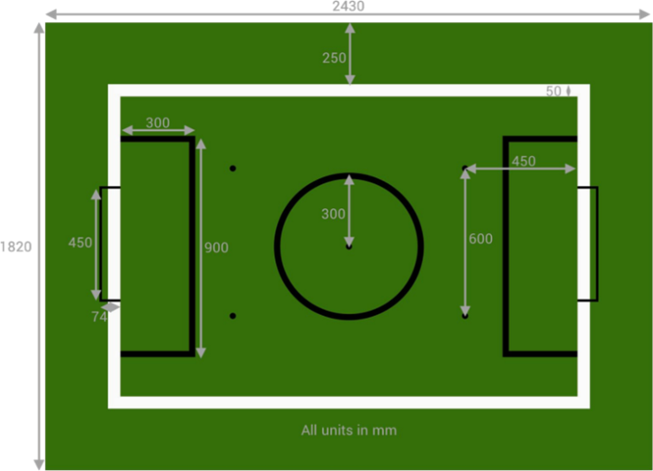

<br><br>

초기에는 로보컵 협회에서 구입한 축구로봇으로 연구를 진행하였다.

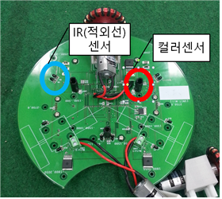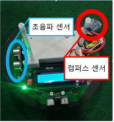

Atmel 보드를 기반으로 제작되었으며 Atmel Studio(C언어)를 지원한다.

디스플레이, 속도, 센서 등 하드웨어 제어와 관련된 함수는 뼈대코드로 주어졌고 그 외의 알고리즘을 연구하였다.

<br>

### 공 찾기

```c
void find_ball()
{
	ball_dir = 0;
	max_ir = 0;
	for(int i = 0; i < 6; i++)
	ir[i*2] = analog[i*2] > 240? 128 + analog[i*2+1]/2 : analog[i*2]/2;
	for(int i = 0; i < 5; i++)
	ir[i*2+1] = (int)((float)(ir[i*2] + ir[i*2+2])/2*1.20);
	ir[11] = (int)((float)(ir[10] + ir[0])/2*1.50);
	for(int i = 0; i < 12; i++)
	{
		if(max_ir < ir[i])
		{
			max_ir = ir[i];
			ball_dir = i;
		}
	}
}
```
 위의 코드는 공을 찾는 함수이다. analog 배열에서 IR값을 가져와 공의 방향을 결정한다.

<br>

### ir센서
 ir 센서는 원거리를 감지하는 센서와 근거리를 감지하는 센서, 두 종류로 분류된다. 0 , 2, 4, 6, 8, 10번 ir센서는 원거리를 측정하는 센서이다. 1, 3, 5, 7, 9, 11번 ir센서는 근거리를 측정하는 센서이다.

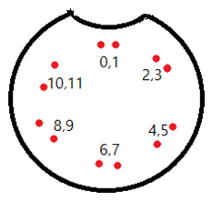

ir센서는 크게 6방향을 향하고 있다.

 기존의 ir센서를 이용한 코드에는 큰 문제점이 존재했다. 측정값을 기준으로 계산하지 않는 것이다. 홀수 번째 방향에서는 측정값의 근사치를 구하는 방법을 사용하여 감지 방향을 방향으로만 분리했다. 그렇지만, 본 연구에서는 방향을 세분화시킴으로써 보다 더 정밀한 움직임을 구현하고자 했다. 방향을 6방향이 아닌 12방향으로 나누어 값을 받아들이도록 했다.

<br>

### 컬러센서
경기장의 흰 색 선을 인식하여 로봇이 선을 넘었는지 판별한다.

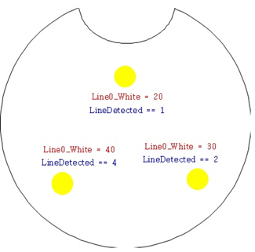

정면 센서가 1번, 왼쪽, 오른쪽이 각각 4번, 2번이다. 측정된 센서 값이 기준치를 넘으면 선 위에 있다고 인식한다.

<br>

### 초음파센서

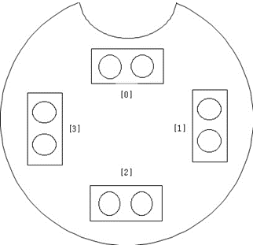

4방향으로 초음파센서가 1개씩 있다. 공이나 로봇, 경기장 벽과의 거리를 판단한다.

<br>

### 컴퍼스센서
로봇의 방향과 위치를 판단한다. 경기장 중앙에서 상대 팀의 골대를 정면으로 바라봤을 때를 기준으로 한다.

<br>

### 회전 및 이동
로봇을 원하는 방향으로 움직이기 위하여 모터를 어떤 방향으로 얼만큼 움직일지를 그림으로 표현하면 다음과 같다.  
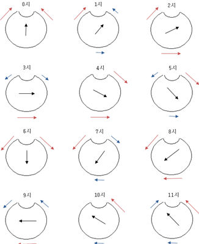
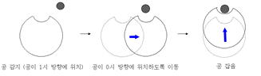

<br>

### 공격 프로그램
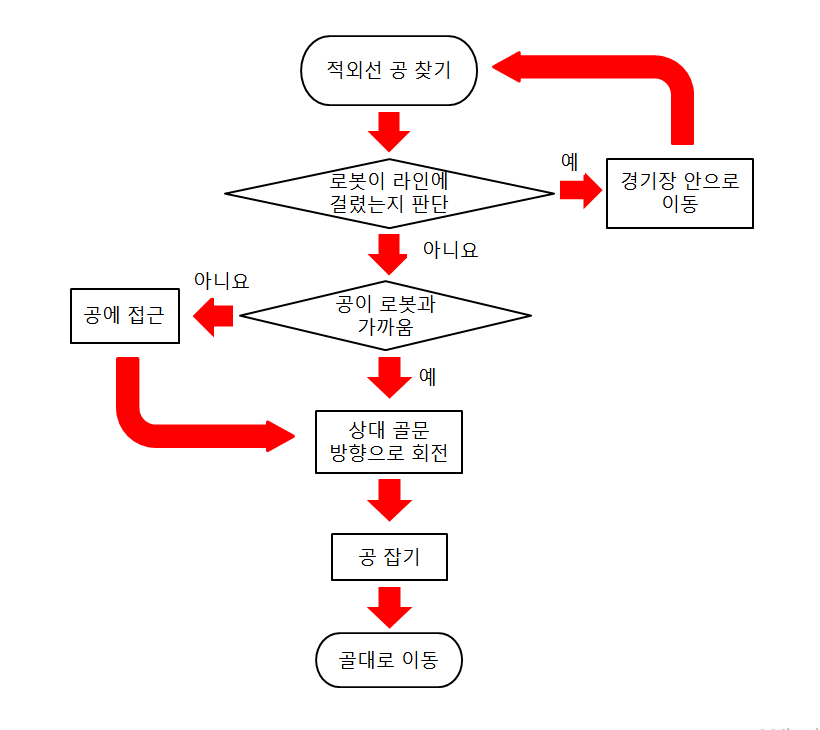

<br>

### 수비 프로그램
공이 멀리 떨어져있는 경우 골대 중앙에 가만히 있는다. 공이 골대 가까이에서 탐지되면 공이 있는 방향쪽으로 움직여 골대를 막는다. 

<br>

## 제작 로봇

초기에는 로보컵 협회에서 구입한 축구로봇으로 연구를 진행하였지만 모터의 작은 토크와 센서 위치 등의 하드웨어적 한계로 전략을 구현하는데 어려움을 겪어 아두이노 기반의 로봇을 직접 제작하게 되었다.
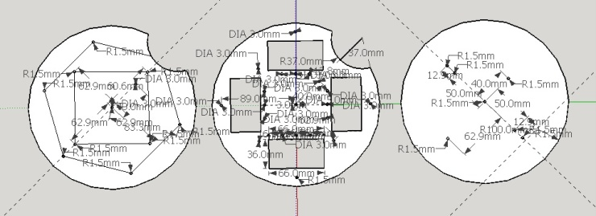
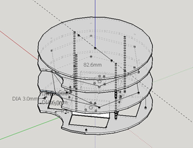
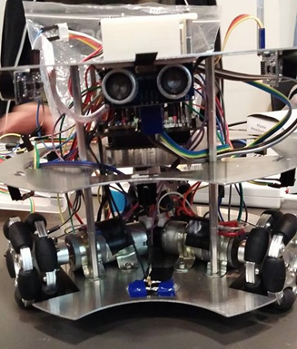
